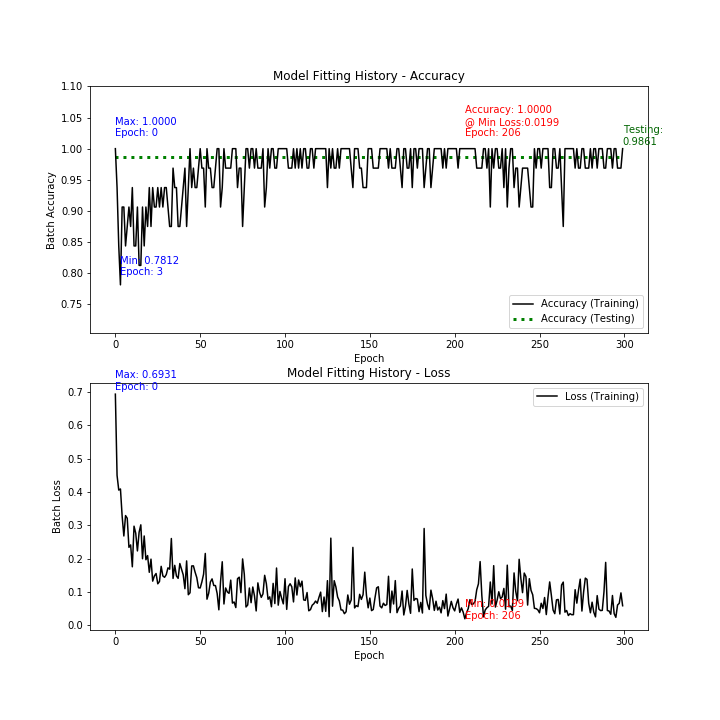
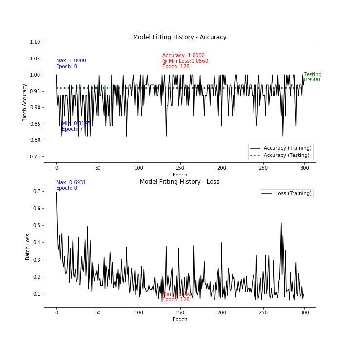

# Deep Learning Notes
This repository contains selected notes and code snippets for Deep Learning (neural networks) that I have created or collected and enhanced.

# Technologies Used

* Python, Jupyter Notebook
* Deep Learning, Sci-Kit Learn, Keras
    * Dataset Generation
    * Regression
    * Classification
* Matplotlib

# Reference

* GitHub: https://github.com/daddyjab/DL_Notes
* Jupyter Notebooks:
    * 01-DL-Single_Node_Neural_Network: 
    https://github.com/daddyjab/DL_Notes/blob/master/01-DL-Single_Node_Neural_Network.ipynb 

# Visualizations

The single node neural network was fitted using 60,000 training examples in batches of 32 examples per iteration.  The results for some digits were very good, while the probably of correctly predicting the target digit was lower with other digits.
* With `SINGLE_TARGET_DIGIT = 1`, the model performed well, which might be expected since the digit `1` is fairly different in appearance than other digits 0 and 2 through 9.

| <b>Table DL-01-A: Single Node Neural Network Performance - Single Target Digit = 1</b> |
|:--------------------------------------------------------------------------------------:|

|            | Training Data | Testing Data |
|:------------|:---------------:|:--------------:|
| Count of Examples | 60,000 | 10,000 |
| Count of Target Digit in Examples | 6,742 (11.2%) | 1,135 (11.3%) |
| Accuracy | 0.9840 | 0.9861 |
| Probability of Predicting Correctly when Example is the Target Digit | 0.9058 | 0.9075 |
| Probability of Predicting Correctly when Example is Not the Target Digit | 0.9939 | 0.9962 |
| Fitting Epochs (Iterations) | 300 | n/a |
| Fitting Batch Size | 32 | n/a |
| Minimum Batch Loss | 0.0199 @ Epoch 206 | n/a |

 

* However, with `SINGLE_TARGET_DIGIT = 3`, a digit that is more easily confused with other digits, the model performed more poorly.
    * The probability of the model correctly predicting the target digit = 3 is low at 0.6525, reflecting the more difficult challenge in distinguishing 3 from digits such as 0 or 8.  The model is biased towards an example digit being non-target (vs. being the target digit 3).
    * The overall accuracy is high (0.9600), but this is mainly because 89.9% of examples in the testing data are *not* the target digit 3, and correct predictions of digits as being non-target is good at 0.9945.

| <b>Table DL-01-B: Single Node Neural Network Performance - Single Target Digit = 3</b> |
|:--------------------------------------------------------------------------------------:|

|            | Training Data | Testing Data |
|:------------|:---------------:|:--------------:|
| Count of Examples | 60,000 | 10,000 |
| Count of Target Digit in Examples | 6,131 (10.2% of total) | 1,010 (10.1% of total) |
| Accuracy | 0.9581 | 0.9600 |
| Probability of Predicting Correctly when Example is the Target Digit | 0.6462 | 0.6525 |
| Probability of Predicting Correctly when Example is Not the Target Digit | 0.9936 | 0.9945 |
| Fitting Epochs (Iterations) | 300 | n/a |
| Fitting Batch Size | 32 | n/a |
| Minimum Batch Loss | 0.0560 @ Epoch 128 | n/a |

 
* Going foward, the single node  neural network class can be modified to implement more capable neural networks with multiple nodes and layers.

| Figure DL-01-C: Model Fit History for a Single Node Neural Network - Single Target Digit = 1 | Figure DL-01-D: Model Fit History for a Single Node Neural Network - Single Target Digit = 3 |
|:----------:|:----------:|
|  |  |
